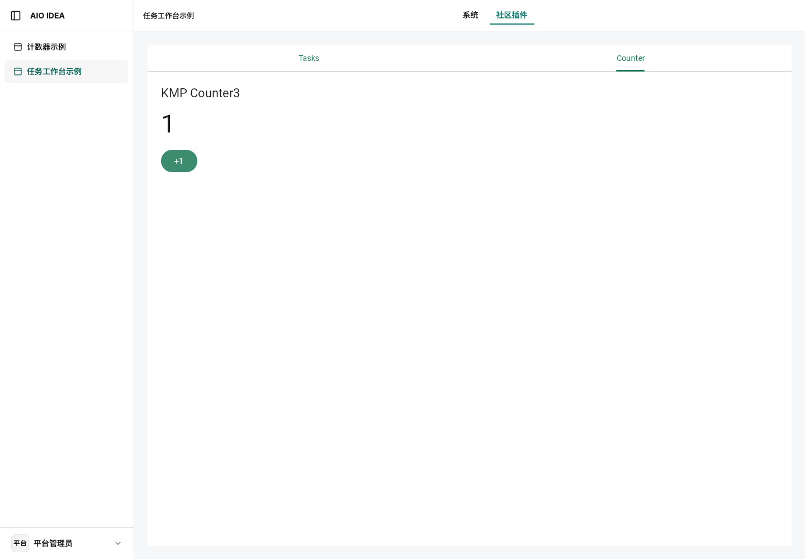
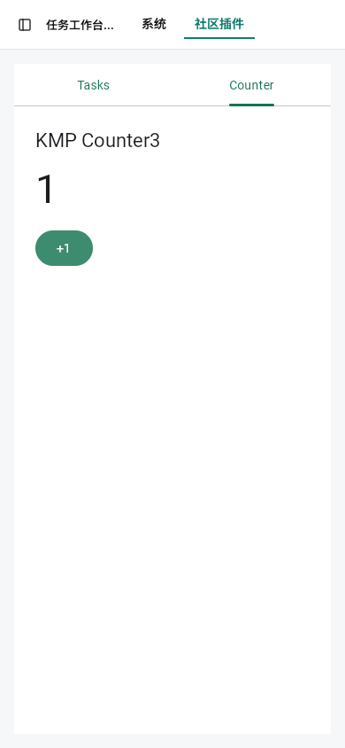

# 平台宿主与插件开发沙箱验收 · 2026-09-14

## 交付版本

- npm：`@zjarlin/aio@2026.9.14`，macOS arm64 / Linux x64 携带同版本 `aio-host` 和预编译 Web。其余平台保留 CLI，不计入本轮宿主调试验收。
- [发布流水线](https://github.com/zjarlin/aio-platform/actions/runs/34838088395)：所有构建和 npm 发布成功，来源 `6826bceba824aa614874b076d7899bd276bbbe03`。入口包 npm SHA-1：`5e2b9d37bfd31fa6016548c2e9b23b789862b213`。
- 平台抽取：`62ecf45f070b9a9c7f2fab9950eadbe780bd4240`；后续发布修复 PostgreSQL TCP 就绪检查、锁定编译工具链及 npm 退出信号转发。
- AIO IDEA：`3d3f423202de26b071ab96c067f6aa46a8f1f086`，已部署 252。产品直接消费平台通用宿主；身份、品牌、默认组合和生产配置留在产品。
- 共享 UI：`cc676107118a3fa83ac891dd97e35279ab9bebbd`。KMP 示例：`01ea4a1cf08e489134cb6156a96f919d47c26411`。Rust 示例：`739becece2a22aa1451f3b12111fa155d473fba9`。

## 直接开始

```sh
npm install -g @zjarlin/aio@2026.9.14
aio --version
cd /path/to/aio-plugin-kmp-example
aio plugin dev . --debug
```

本次工作站使用独立 Colima profile，启动时加 `DOCKER_CONTEXT=colima-aio-dev`。其他机器使用自己的 Docker 引擎。三种语言需要对应工具链；详见[开发文档](../README.md)。无需克隆 `aio-idea`、创建远端仓库、提交或 push。

## 实际验证

| 验收项 | 结果及证据 |
| --- | --- |
| macOS Apple Silicon / Linux x64，三种新插件、真实壳及前后端 | 桌面 / 移动共 **12 项通过**，无跳过、失败或重试；[Playwright JSON](playwright-results.json) |
| npm 自带宿主 / Web | macOS 从公开 npm 安装后新建三种无 Git 插件；Linux 使用对应发布产物完成三语言离线调用，[分发](npm-distribution.json)、[Linux](linux-offline-playwright.json) |
| Kotlin/Wasm 源码断点 | 两个平台均在壳 iframe 中映射到 `CounterPage.kt:20`，读取 `$count=0`，单步并继续；[macOS](kmp-frontend-breakpoint.json)、[Linux](linux-kmp-frontend-breakpoint.json) |
| JVM 源码断点 | 页面真实请求命中 `TaskStore.kt:28`，读取 tenant/user/search；暂停 32 秒再继续，响应 200，无重启；[macOS 日志](macos-jvm-breakpoint.txt)、[Linux 日志](linux-jvm-breakpoint.txt)、[Linux 请求](linux-jvm-source-browser.json) |
| 前端修改与路由 | KMP 桌面 / 移动自动更新，保留 Counter 路由和后端 PID；[证据](kmp-reload.json) |
| 本地必需依赖与权限 | 只加载目标及声明依赖，允许调用返回 200，未声明调用返回 403；[证据](v2-flow.json) |
| 正式包与锁定依赖 | 实际目录下载已发布包，锁定完整 SHA / 摘要；断网重启得到相同两插件和调用结果；[在线](dependency-online.json)、[离线](dependency-offline.json) |
| Linux 进程包在 Mac 运行 | 正式包校验、amd64 容器、真实 broker/数据库调用、禁止网络及只读根文件系统；[证据](container-flow.json) |
| 失败与连续保存 | 编译失败保留旧页面；连续保存仅激活最终版本；共享模型同时更新前后端；[失败恢复](typescript-offline-flow.json)、[连续保存](continuous-save.json) |
| 无变化 / no-watch | 35 秒无变化不重新挂载；no-watch 下修改源码不触发重载；[证据](no-watch.json) |
| 数据与进程生命周期 | 三次新 PostgreSQL 卷启动、SIGTERM 清理、端口冲突、外部数据库不停止、跨项目 DB 拒绝、手工 IDE 配置保留；[证据](lifecycle.json) |
| 重启数据保留 | 本地依赖空间 ID 在重启后相同；[证据](v2-restart-evidence.json) |
| 生产独立数据库预演 | 身份 / 权限 / 会话、资源及撤权、发布和升级三组真实 PostgreSQL 回归通过；[证据](product-regression.json) |
| 公网部署 | 252 当前 release 为产品 SHA；已登录桌面 / 移动保持 **KMP Counter3** 且计数正常，无页面异常；[证据](production.json) |

KMP 用户源码最终保持 `KMP Counter3`。只在临时项目或测试期间修改标签，随后恢复；未为本地开发调用市场发布接口。

## 离线与耗时

macOS 使用操作系统出站网络限制，仅允许回环与 Unix socket；三种插件已有缓存后均成功启动、修改并完成真实调用。[启动证据](offline-startup.json)。

Linux 三种插件和独立 PostgreSQL 放入 Docker internal 网络，逐容器确认公网请求被阻断。使用发布包自带的宿主与 Web 完成桌面 / 移动 **6 项额外验收**，以及三语言源码修改后真实重载；TypeScript 继续覆盖编译失败、恢复及无变化轮询。[网络证据](linux-offline-network.json)、[Playwright](linux-offline-playwright.json)。浏览器通过 SSH 访问专用代理，未为开发宿主打开公网监听。

公开 npm 安装后的新项目和缓存重启测量如下（从命令启动到完成激活；已有语言工具链 / 下载缓存）：

| 语言 | 新项目首次构建 | 同项目缓存重启 |
| --- | ---: | ---: |
| TypeScript | 5.784 s | 1.116 s |
| Kotlin | 37.614 s | 2.849 s |
| Rust | 55.023 s | 1.627 s |

[原始结果](npm-distribution.json)。全部使用配套二进制和 Web 资源，完成真实前后端调用，并验证退出清理。

以下重载均为一次测量，不代表全新机器下载耗时。激活到开始挂载与插件完成渲染分开记录：

| 平台 / 插件 | 修改到可见总耗时 | 激活到开始挂载 | 激活到可见 |
| --- | ---: | ---: | ---: |
| macOS Kotlin（禁止公网） | 29.001 s | 4 ms | 7.685 s |
| macOS Rust（禁止公网） | 22.954 s | 5 ms | 6.632 s |
| Linux Kotlin（4 CPU / 8 GiB） | 69.589 s | 13 ms | 10.938 s |
| Linux Rust（4 CPU / 8 GiB） | 65.422 s | 41 ms | 8.585 s |
| Linux Kotlin（禁止公网） | 57.110 s | 13 ms | 2.878 s |
| Linux Rust（禁止公网） | 40.362 s | 7 ms | 1.955 s |

Linux 总耗时包含 SSH 写入和并发构建，均使用暖缓存。TypeScript 离线修改到可见：macOS 1.879 s、Linux 6.490 s（含 SSH 写入）。上述浏览器切换由宿主通知触发，未刷新页面。

## 回归与生产安全

CLI 单元 40、CLI 集成 2、包校验 13、开发模型 5、通用宿主 55 项通过；常规宿主测试中的 5 项数据库用例默认忽略，所需真实数据库场景已另外执行。数据库角色隔离 / 历史角色重启 2 项通过；浏览器桥相关 23 项、npm 分发相关 7 项通过。边界检查及 `git diff --check` 通过。

产品三组独立数据库回归包含首次安装、失败保留旧版、多租户升级、停用 / 卸载不复活、回滚保留到下一成功发布、过期构建拒绝及无变化轮询。正式包格式及现有持久化角色名称保持可读。

测试结束后已停止本轮启动的宿主、调试器连接、专用 PostgreSQL 与 SSH 转发，并注销本轮公网测试会话。保留开发数据和增量缓存，Colima 的 `aio-dev` profile 留给后续开发使用。[清理记录](cleanup.json)。

部署前保留数据库及组件备份：SHA-256 分别为 `67b28308e4a83175c9621d975316e9e720734240a6a77ef241a12f5b293a6498`、`7c7558ac41d73e1284bf228243fb267a898a7228ea8ed194e108638d8229b93e`。旧 release 可回退；备份与凭据保存在部署专属目录，未提交到仓库。

## 证据位置与明确限制

- 本目录保存脱敏 JSON、断点日志和桌面 / 移动截图。运行时前端 capability 地址已脱敏。
- 完整 Playwright HTML 报告保存在本机 `aio-platform/target/development-report/html/index.html` 和 `target/linux-offline-report/html/index.html`；原始运行日志位于 `target/sandbox-acceptance/`。数据库连接、会话和私钥不属于公开证据。
- **IntelliJ 图形界面的 Run / Attach 操作尚未验收：工作站锁屏，无法操作其 UI。** 已生成并验证配置保留规则，且 Chrome 调试协议与 JVM 调试协议在两平台实际命中源码断点。这不能替代 IntelliJ UI 的验收。
- Rust 提供 debug 产物与符号；未宣称所有系统均已实现 Wasm Component 源码单步。




