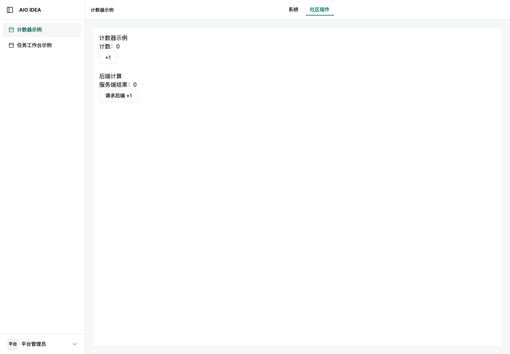
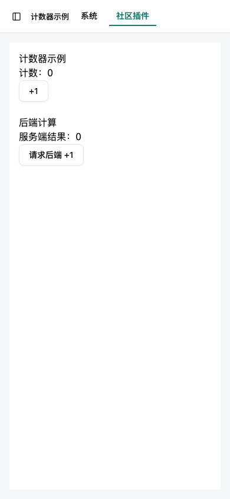

# 首页中文编码修复验收

2026-09-15，`https://aio.addzero.site` 已部署 `aio-idea` 提交 `1c9fc15b54c45b5b32d2772083149dc7d7b02b42`，消费平台修复 `2006b49faee8bb1a5207487079db53d7bea5d508`。

## 问题与修复

插件目录接口返回正确中文。首页却把中文启动快照插入字符集声明之前，同时只返回 `Content-Type: text/html`。当前验收账号的字符集声明位于第 2266 字节，超出前 1024 字节的编码预扫描范围；错误识别文档编码时，导航使用的内嵌 JSON 也会被错误解码。

共享宿主现在为 HTML 统一返回 `text/html; charset=utf-8`，并把唯一的 UTF-8 meta 放在 head 首位、启动快照之前。生产页面中的声明位于第 40 字节。[修复前响应证据](before.json)、[修复后结果](results.json)。

## 验证

- 通用宿主 56 项测试通过，5 项需要独立数据库的测试按默认配置忽略。新增大段中文快照测试，同时覆盖已有和缺失字符集声明；原有脚本闭合转义测试继续通过。静态首页和 SPA fallback 均校验 UTF-8 响应头。
- 旧线上响应未通过编码响应头回归断言。修复上线后，中文 locale 的 Chrome 桌面、移动用例全部通过，实际文档编码为 UTF-8，场景和插件名称与目录接口一致，无页面异常。
- 产品服务端测试和 Web 检查通过；252 的发布路径、systemd 运行状态、私网和公网健康检查通过。保留旧 release，可回退。
- 对应浏览器回归：`tests/browser/document-encoding.cjs`。本轮创建的公网测试会话在验收后注销。

已打开的旧页面需要刷新一次，以重新解析修复后的 HTML。

